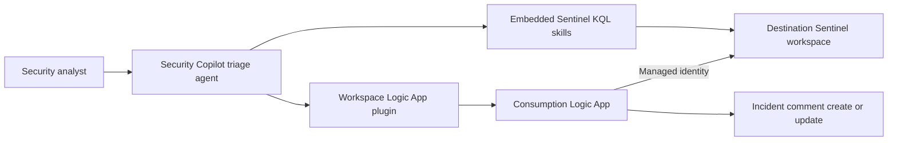

# Sentinel Autonomous Triage Agent - Cross-Tenant Deployment Kit

This kit deploys the tested autonomous Microsoft Sentinel triage solution into another Microsoft Entra tenant. It includes:

- A Consumption Logic App with a system-assigned managed identity.
- A least-privilege Microsoft Sentinel Responder role assignment.
- A workspace-shared Security Copilot Logic App plugin manifest.
- A workspace-shared Security Copilot agent manifest with three embedded Sentinel KQL skills.
- Preflight, manifest rendering, deployment, and validation scripts.

The kit does not deploy automatically. Run the what-if and review it before using `-Apply`.

> **Tenant boundary:** Cross-tenant means you can deploy an independent copy into a different destination tenant. The destination Security Copilot workspace, Logic App, and Sentinel workspace must belong to that same destination Microsoft Entra tenant. Security Copilot cannot invoke this Logic App across tenant boundaries.

All commands in this guide assume PowerShell 7 or Windows PowerShell 5.1 and start from this folder:

```powershell
Set-Location "AI Security/Custom Agents/Sentinel Autonomous Triage Agent Cross-Tenant"
```

## Architecture



## Package Contents

| Path | Purpose |
|---|---|
| `config/deployment.config.example.json` | Destination-tenant configuration template. |
| `infra/deploy.bicep` | Subscription-scope entry point; creates the Logic App resource group. |
| `infra/main.bicep` | Logic App and destination workspace integration. |
| `infra/sentinel-rbac.bicep` | Microsoft Sentinel Responder assignment for the Logic App identity. |
| `infra/workflow-definition.json` | HTTP-triggered marker-based incident comment upsert workflow. |
| `scripts/Deploy-Azure.ps1` | What-if by default; deploys only with `-Apply`. |
| `scripts/New-TenantManifests.ps1` | Renders tenant-specific Security Copilot manifests. |
| `scripts/Test-DeploymentKit.ps1` | Compiles Bicep and checks generated manifests for unresolved tokens and required destination values. |
| `samples/writeback-request.json` | Logic App request contract example. |
| `templates/agent.template.yaml` | Environment-neutral Security Copilot agent template. |
| `templates/logic-app-plugin.template.yaml` | Environment-neutral Logic App plugin template. |

The renderer uses the two tokenized manifests included in this kit:

- `templates/agent.template.yaml`
- `templates/logic-app-plugin.template.yaml`

## 1. Destination-Tenant Prerequisites

1. A Microsoft Security Copilot workspace and capacity must exist in the destination tenant.
2. Microsoft Sentinel must be enabled on a Log Analytics workspace.
3. The deployment operator must be able to:
   - Deploy resources in the Logic App subscription and resource group.
   - Read the destination Log Analytics workspace.
   - Create role assignments on the Sentinel workspace. `Owner` or `User Access Administrator` plus resource deployment rights is typically required.
   - Access both subscriptions when the Logic App and Sentinel workspace use different subscriptions. Both subscriptions must be in the destination tenant.
4. Security Copilot must allow Owners or Contributors to upload custom plugins for everyone in the workspace.
5. The identity selected during Security Copilot agent setup must be able to query the destination Sentinel workspace. Assign the minimum role that satisfies your governance model; Microsoft Sentinel Reader is sufficient for reads, while the Logic App managed identity receives Microsoft Sentinel Responder for comment writeback.
6. Install Azure CLI and Bicep. Confirm:

   ```powershell
   az version
   az bicep version
   ```

7. Register these resource providers if they aren't registered. Select the relevant subscription before each registration when the Logic App and Sentinel use different subscriptions:

   ```powershell
   az provider register --namespace Microsoft.Logic
   az provider register --namespace Microsoft.OperationalInsights
   az provider register --namespace Microsoft.SecurityInsights
   ```

## 2. Configure the Destination

Copy the example configuration and replace every placeholder:

```powershell
Copy-Item .\config\deployment.config.example.json `
   .\config\deployment.config.json
```

The scripts reject all-zero placeholder GUIDs. The local `deployment.config.json` and generated manifests are excluded from Git because they contain destination-environment identifiers.

Important fields:

| Field | Meaning |
|---|---|
| `tenantId` | Destination Microsoft Entra tenant ID. |
| `azureSubscriptionId` | Subscription where the Logic App resource group is created. |
| `sentinelSubscriptionId` | Subscription containing the destination Sentinel workspace. |
| `sentinelResourceGroupName` | Resource group containing the Sentinel workspace. |
| `sentinelWorkspaceName` | Log Analytics workspace name, not its GUID. |
| `sentinelWorkspaceCustomerId` | Workspace GUID. Leave blank to retrieve it from Azure during rendering. |
| `solutionPrefix` | Unique alphanumeric prefix for plugin and agent internal names. |
| `securityCopilotWorkspaceName` | Operator reference for the target Security Copilot workspace. |

Use a unique `solutionPrefix` to prevent the stale dependency collisions seen when identical skillset names already exist.

The rendered names are derived from this prefix. For example, `"solutionPrefix": "Contoso"` produces:

- Agent display name: **Contoso Sentinel Triage Agent**
- Plugin display name: **Contoso Sentinel Comment Upsert**
- Agent internal name: `ContosoSentinelTriageAgent`
- Plugin internal name: `ContosoSentinelCommentUpsert`

## 3. Authenticate to the Destination Tenant

```powershell
$config = Get-Content .\config\deployment.config.json -Raw | ConvertFrom-Json
az login --tenant $config.tenantId
az account set --subscription $config.azureSubscriptionId
az account show --query '{tenantId:tenantId,subscriptionId:id,user:user.name}'
```

Verify that the returned tenant and subscription match the configuration file.

## 4. Validate and Render the Package

```powershell
.\scripts\Test-DeploymentKit.ps1 `
   -ConfigPath .\config\deployment.config.json
```

The command:

1. Parses the workflow and configuration JSON.
2. Compiles the Bicep templates.
3. Reads the destination workspace GUID from Azure.
4. Creates these tenant-specific manifests under `generated/`:
   - `logic-app-plugin.securitycopilot.yaml`
   - `agent.securitycopilot.yaml`
5. Fails if a placeholder or unresolved template token remains.

Upload only the newly rendered files in `generated/`.

## 5. Review the Azure Deployment

Run a what-if preview. This is the script's default mode:

```powershell
.\scripts\Deploy-Azure.ps1 `
   -ConfigPath .\config\deployment.config.json
```

Expected resources and changes:

- One resource group if it does not exist.
- One Consumption Logic App with system-assigned identity.
- One Microsoft Sentinel Responder role assignment scoped to the destination Sentinel workspace.
- No API connections, passwords, callback URLs, or secrets.

Review destination Azure Policy results and resolve any denied locations, required tags, or identity restrictions before deployment.

## 6. Deploy Azure Resources

After reviewing what-if:

```powershell
.\scripts\Deploy-Azure.ps1 `
   -ConfigPath .\config\deployment.config.json `
  -Apply
```

Record the outputs, especially `logicAppPrincipalId` and `logicAppResourceId`.

The workflow uses built-in HTTP actions and managed identity, so no API connection resource or secret is required. The Bicep assignment grants the Logic App identity Microsoft Sentinel Responder on only the target workspace.

Microsoft Sentinel Responder includes workspace query/read and incident-management permissions required by this workflow. Do not broaden it to Contributor unless your organization has a separate requirement.

Allow several minutes for the role assignment to propagate before testing.

## 7. Upload the Logic App Plugin

Perform this step before uploading the agent.

1. Sign in to the destination tenant at <https://securitycopilot.microsoft.com/>.
2. Select the correct Security Copilot workspace.
3. From the Home prompt bar, select **Sources**.
4. Open **Manage plugins**, scroll to **Custom**, and select **Upload plugin**.
5. For **Who can use this plugin?**, select **Anyone in this workspace**.
6. Select **Security Copilot plugin**.
7. Upload `generated/logic-app-plugin.securitycopilot.yaml`.
8. Complete setup if prompted and enable the plugin.
9. Confirm its badge is **Workspace**, not **Private**.

## 8. Upload and Publish the Agent

1. Open **Build** in Security Copilot.
2. Select **Upload a YAML manifest**.
3. Upload `generated/agent.securitycopilot.yaml`.
4. Verify the preview contains exactly:
   - The generated agent skillset.
   - The generated Logic App plugin skillset.
   - Three embedded KQL skills.
   - One Logic App writeback skill.
5. Confirm no source-tenant, v2, v3, EXL, or unrelated plugin dependencies appear.
6. Publish with **For everyone in workspace**.
7. In **Agents**, find the newly published agent and select **Set up**.
8. Choose the intended run identity and complete setup.
9. Confirm the agent appears under **Agents in use** as **Active** and does not show **Just you**, **Private**, or **Authentication expired**.

## 9. Validate End to End

Use a low-risk test incident in the destination workspace.

1. Record the incident number and its current comments.
2. Run the new workspace agent with:

   ```text
   Investigate Sentinel incident <NUMBER> and write back the triage report.
   ```

3. Confirm all three generated KQL skills execute.
4. Confirm the generated Logic App plugin skill executes once.
5. In Logic App run history, verify the run status is **Succeeded**.
6. In Sentinel, verify the incident contains one comment beginning with `=== INCIDENT TRIAGE REPORT ===`.
7. Run the same incident again and verify the existing marked comment is updated rather than duplicated.
8. Confirm the agent evaluation contains no `query_lake`, malformed OBO authority, missing skill, or authorization errors.

## 10. Troubleshooting

| Symptom | Check |
|---|---|
| Agent says `Ready for setup` | Complete setup for the workspace-scoped definition, not a similarly named private definition. |
| Agent shows `Just you` | Republish with **For everyone in workspace**. Scope cannot reliably be converted by reusing the same private internal name; use a unique `solutionPrefix`. |
| Plugin shows `Private` | Upload the generated plugin again with **Anyone in this workspace** and a unique internal name. |
| `Invalid references` | Upload and enable the Logic App plugin before publishing the agent. Confirm the generated `RequiredSkillsets` and `ChildSkills` names match. |
| `401` or `403` from Logic App | Confirm its system-assigned identity has Microsoft Sentinel Responder on the target workspace and wait for RBAC propagation. |
| Incident cannot be resolved | Confirm the workspace customer ID and `SecurityIncident` table access. The Logic App identity must be able to query the workspace. |
| `Authentication expired` | Reauthenticate the Security Copilot portal and reopen the agent. |
| Duplicate old dependencies | Use a new `solutionPrefix`; do not reuse old skillset names. |

## Security and Operational Notes

- The Logic App callback URL is not stored in this package or agent manifest.
- The workflow uses system-assigned managed identity and Azure Resource Manager/Log Analytics audiences.
- The only write action is the incident comment PUT operation.
- Keep the role assignment at workspace scope unless organizational policy requires resource-group scope.
- Test privately first if required by change control, then publish the final unique manifests to workspace scope.
- Review Azure Activity Log, Logic App run history, and Sentinel incident activity logs after deployment.
- Treat generated reports as analyst decision support; the agent instructions require analyst validation before action or closure.

## Remove the Deployment

1. Disable and remove the custom agent and Logic App plugin from Security Copilot.
2. Delete the Logic App resource group only after confirming that it contains no unrelated resources.
3. Verify that the deterministic Microsoft Sentinel Responder role assignment was removed with the deployment.
4. Delete local `config/deployment.config.json` and `generated/` files if they are no longer needed.

Example for a dedicated Logic App resource group:

```powershell
az group delete `
   --subscription "<LOGIC_APP_SUBSCRIPTION_ID>" `
   --name "<LOGIC_APP_RESOURCE_GROUP>" `
   --yes
```

## ⚠️ Disclaimer

This project is provided for educational and demonstration purposes only.

The software, agents, workflows, prompts, and examples included in this repository are provided **"as is"**, without warranties or guarantees of any kind, express or implied. The authors and contributors make no representations regarding reliability, safety, suitability, security, legality, or fitness for any particular purpose.

By using this project, you acknowledge and agree that:

- 🧑‍💻 You are solely responsible for how you use, modify, deploy, or distribute the software.
- 🧪 You must thoroughly test the project in a controlled and secure environment before using it in production or with sensitive systems/data.
- 🤖 AI agents and automated systems may produce unexpected, inaccurate, incomplete, or harmful outputs and actions.
- ⚠️ This project may contain experimental features, unsafe behaviors, or incomplete safeguards.
- 🚫 The authors are not responsible for any damage, losses, security incidents, operational failures, legal issues, compliance violations, data loss, financial losses, or other consequences resulting from the use of this project.
- 📜 Users are responsible for ensuring compliance with all applicable laws, regulations, platform policies, licensing requirements, and organizational security practices.

This repository is not intended for use in safety-critical, regulated, or production environments without independent review, validation, monitoring, and appropriate safeguards.

### 🚨 Use at your own risk.

## Microsoft References

- [Azure Logic Apps plugin in Microsoft Security Copilot](https://learn.microsoft.com/copilot/security/developer/plugin-logic-apps)
- [Build Security Copilot agents using YAML](https://learn.microsoft.com/copilot/security/developer/build-agent-manifest)
- [Publish a custom agent](https://learn.microsoft.com/copilot/security/developer/publish-agent-dev)
- [Manage plugins in Microsoft Security Copilot](https://learn.microsoft.com/copilot/security/manage-plugins)
- [Authenticate playbooks to Microsoft Sentinel](https://learn.microsoft.com/azure/sentinel/automation/authenticate-playbooks-to-sentinel)
- [Managed identities in Azure Logic Apps](https://learn.microsoft.com/azure/logic-apps/authenticate-with-managed-identity)
- [Microsoft Sentinel roles and permissions](https://learn.microsoft.com/azure/sentinel/roles)