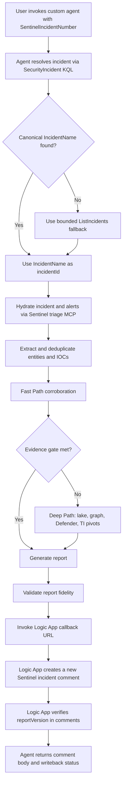
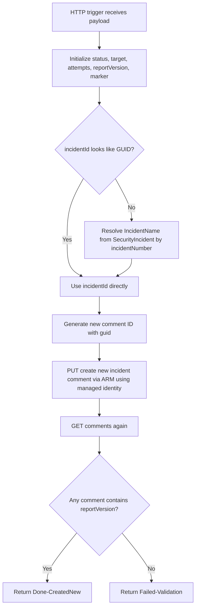

# Sentinel SOC Triage Autopilot

This folder contains a portable GitHub Copilot custom agent and a redacted Azure Logic App deployment template for autonomous Microsoft Sentinel incident triage with verified incident comment writeback.

The agent is designed for authorized defensive SOC operations. It uses Microsoft Sentinel MCP triage and data exploration capabilities to analyze an incident, produce a SOC-ready report, and call a Logic App that appends a new automation-generated incident comment for each execution.

## Runtime environment

This custom agent was created for and tested in a Visual Studio Code + GitHub Copilot environment with Microsoft Sentinel MCP servers enabled.

Expected MCP capabilities include:

- Sentinel triage MCP collection for incident, alert, and entity triage.
- Sentinel data exploration MCP collection for KQL/lake queries, graph telemetry, entity analysis, and IOC/TI correlation.

The Logic App deployment template is Azure-native and can be deployed independently, but the full automated agent workflow requires the Sentinel MCP servers to be available in the Copilot environment.

## Contents

| File | Purpose |
| --- | --- |
| `sentinel-soc-triage-autopilot.agent.md` | Portable custom agent instructions. |
| `logic-app/infra/main.bicep` | Redacted Bicep template for the Logic App Consumption playbook and managed identity RBAC. |
| `logic-app/infra/workflow-definition.json` | Logic App workflow definition for append-only incident comment writeback. |
| `logic-app/infra/main.parameters.sample.json` | Sample deployment parameters. Copy to `main.parameters.json` before deployment. |
| `read.md` | This deployment and execution guide. |

## What the agent does

1. Accepts a Sentinel incident number as input.
2. Resolves the incident number to the canonical Sentinel incident resource name/GUID using `SecurityIncident.IncidentName`.
3. Hydrates the incident and related alert evidence using Sentinel triage MCP tools.
4. Uses Sentinel data exploration MCP tools for KQL/lake queries, entity enrichment, graph telemetry, and IOC/TI correlation.
5. Generates two synchronized report renderings: HTML tables for Sentinel comments and Markdown tables for VS Code/GitHub Copilot readability.
6. Sends only the HTML-formatted Sentinel comment body to the Logic App callback URL.
7. The Logic App creates a new incident comment for each unique report version using a generated comment ID, and skips creation if the same report version already exists.
8. The Logic App verifies the report version is present in Sentinel comments and returns a structured Done/Failed status.

## Execution flow



## Report rendering behavior

The agent intentionally produces two synchronized report renderings from the same evidence and verdict:

| Rendering | Format | Destination | Purpose |
| --- | --- | --- | --- |
| `sentinelCommentBody` | Simple HTML tables | Logic App / Microsoft Sentinel incident comment | Renders as readable tables in Sentinel. |
| `analystReadableReport` | GitHub-flavored Markdown tables | VS Code / GitHub Copilot final response | Renders as readable Markdown tables for analysts. |

The Logic App receives only `sentinelCommentBody` in the `commentBody` field. The final Copilot response shows `analystReadableReport` plus the writeback execution result.

The prompt also instructs the agent to use real line breaks and avoid literal `` `n`` / `\n` text in rendered report sections.

## Logic App writeback flow



## MCP server expectations

Enable Microsoft Sentinel MCP servers that expose these collections:

- Triage collection: `https://sentinel.microsoft.com/mcp/triage`
- Data exploration collection: `https://sentinel.microsoft.com/mcp/data-exploration`

The agent expects the triage collection for incident and alert operations, including incident hydration, alert listing, and priority alert detail retrieval.

The agent expects the data exploration collection for:

- `search_tables`
- `query_lake`
- user and URL/domain entity analyzers
- graph telemetry operations such as `get_graph_context`, `find_exposure_perimeter`, `find_blastradius`, `find_walkable_paths`, `find_connected_nodes`, and `find_nodes`

## Azure deployment prerequisites

You need:

- Azure CLI signed in with permission to deploy to the target resource group.
- Existing Microsoft Sentinel workspace in the target resource group.
- Permission to create Logic Apps and role assignments.
- Permission to assign the built-in `Microsoft Sentinel Contributor` role to the Logic App managed identity on the workspace scope.

## Deploy the Logic App

From this folder:

```powershell
cd "logic-app\infra"
copy main.parameters.sample.json main.parameters.json
```

Edit `main.parameters.json`:

```json
{
  "$schema": "https://schema.management.azure.com/schemas/2019-04-01/deploymentParameters.json#",
  "contentVersion": "1.0.0.0",
  "parameters": {
    "playbookName": {
      "value": "sentinel-incident-comment-upsert"
    },
    "location": {
      "value": "eastus"
    },
    "workspaceName": {
      "value": "<YOUR_SENTINEL_WORKSPACE_NAME>"
    }
  }
}
```

Deploy at resource-group scope:

```powershell
az account set --subscription "<SUBSCRIPTION_ID>"
az deployment group create `
  --resource-group "<RESOURCE_GROUP_NAME>" `
  --template-file ".\main.bicep" `
  --parameters "@.\main.parameters.json"
```

The deployment creates:

- Logic App Consumption workflow.
- System-assigned managed identity.
- Workspace-scoped `Microsoft Sentinel Contributor` role assignment.
- Secure callback URL output. Do not commit or share the callback URL.

## Configure the agent

Open `sentinel-soc-triage-autopilot.agent.md` and replace placeholders:

| Placeholder | Replace with |
| --- | --- |
| `<SUBSCRIPTION_ID>` | Azure subscription ID that contains Sentinel. |
| `<RESOURCE_GROUP_NAME>` | Resource group containing the Sentinel workspace and Logic App. |
| `<WORKSPACE_NAME>` | Microsoft Sentinel / Log Analytics workspace name. |

Keep the Logic App resource ID in this format:

```text
/subscriptions/<SUBSCRIPTION_ID>/resourceGroups/<RESOURCE_GROUP_NAME>/providers/Microsoft.Logic/workflows/sentinel-incident-comment-upsert
```

## Invoke the agent

Example:

```text
Use the Sentinel SOC Triage Autopilot agent for incident 1647.
```

The agent should:

1. Resolve incident `1647` to `SecurityIncident.IncidentName`.
2. Generate a full comment body.
3. Invoke the Logic App callback URL with the HTML-formatted Sentinel comment body.
4. Create a new Sentinel incident comment for this execution.
5. Return a writeback execution result, including `CommentUpdateStatus`, `CommentTarget`, `CommentUpdateAttempts`, and `Verified`.

## Append-only comment behavior

This Logic App is intentionally append-only and idempotent by `reportVersion`: every successful execution with a new report version creates a new Sentinel incident comment. If the same report version is submitted again, the workflow returns success with the existing comment target and does not create a duplicate comment. It does not update or overwrite previous automation-generated comments, even when the stable marker is present.

The request still accepts `mode = "update-or-create"` for compatibility with existing agents, but the workflow follows an idempotent create-new path and returns `Done-CreatedNew` on success. `Done-CreatedNew` can mean either a new comment was created or an existing comment with the same `reportVersion` was found and duplicate creation was skipped.


## Duplicate prevention

The Logic App prevents duplicate comments for the same analysis by checking existing incident comments for the incoming `reportVersion` before creating a new comment.

Behavior:

| Scenario | Result |
| --- | --- |
| New `reportVersion` | Creates a new Sentinel incident comment and returns `Done-CreatedNew`. |
| Existing `reportVersion` | Skips comment creation, returns `Done-CreatedNew`, and returns the existing `commentTarget`. |
| Verification cannot find `reportVersion` | Returns `Failed-Validation`. |

This preserves append-only history for distinct analyses while making retries safe.

## Logic App request contract

The agent invokes the Logic App with this schema:

```json
{
  "subscriptionId": "<SUBSCRIPTION_ID>",
  "resourceGroupName": "<RESOURCE_GROUP_NAME>",
  "workspaceName": "<WORKSPACE_NAME>",
  "incidentId": "<SENTINEL_INCIDENT_RESOURCE_NAME_OR_GUID>",
  "incidentNumber": 1647,
  "reportVersion": "v20260702-073000",
  "generatedUtc": "2026-07-02T07:30:00Z",
  "mode": "update-or-create",
  "marker": "=== INCIDENT TRIAGE REPORT ===",
  "commentBody": "=== INCIDENT TRIAGE REPORT ===\n<h2>Report Metadata</h2>\n<table>...</table>\n=== END OF REPORT ==="
}
```

Important: `incidentId` should be the Sentinel incident resource name/GUID (`SecurityIncident.IncidentName`), not the human incident number. The Logic App includes a fallback resolver for numeric incident IDs, but the agent should still send the canonical value whenever available.

## Logic App response contract

Successful responses look like this. For duplicate retries with the same `reportVersion`, the same status is returned with the existing `commentTarget`:

```json
{
  "status": "Done-CreatedNew",
  "incidentId": "<incident id sent>",
  "incidentNumber": 1647,
  "commentTarget": "<comment id>",
  "commentUpdateAttempts": 1,
  "reportVersion": "v20260702-073000",
  "generatedUtc": "2026-07-02T07:30:00Z",
  "verified": true,
  "errorCode": "",
  "errorMessage": ""
}
```

Status values:

- `Done-CreatedNew`
- `Failed-Authorization`
- `Failed-ToolUnavailable`
- `Failed-Validation`
- `Failed-Unknown`

## Troubleshooting

| Symptom | Likely cause | Fix |
| --- | --- | --- |
| `InvalidSubscriptionId` where value is `resourceGroups` | Payload omitted or blanked `subscriptionId`. | Ensure the agent sends `subscriptionId`; template also has defaults from deployment parameters. |
| `Resource '<number>' does not exist` | Human incident number was used as ARM incident resource name. | Resolve `SecurityIncident.IncidentName` and send it as `incidentId`. |
| `Failed-Authorization` | Managed identity cannot read/write Sentinel incidents/comments. | Confirm `Microsoft Sentinel Contributor` assignment on workspace scope. |
| `Failed-Validation` | Comment write completed but report version was not found during verification. | Check comment body includes exact `Report Version` and marker. |
| Logic App not executed | Agent produced report but skipped external action. | Confirm the final output includes `LogicAppExecuted: yes`; use this package's stricter writeback phase. |

## Security notes

- Do not commit callback URLs, client secrets, tenant secrets, incident data, or customer-specific telemetry.
- The Bicep template outputs the callback URL as a secure output. Treat it as a secret.
- Keep the agent placeholders generic in public repositories.
- Use this only for authorized defensive security operations.


