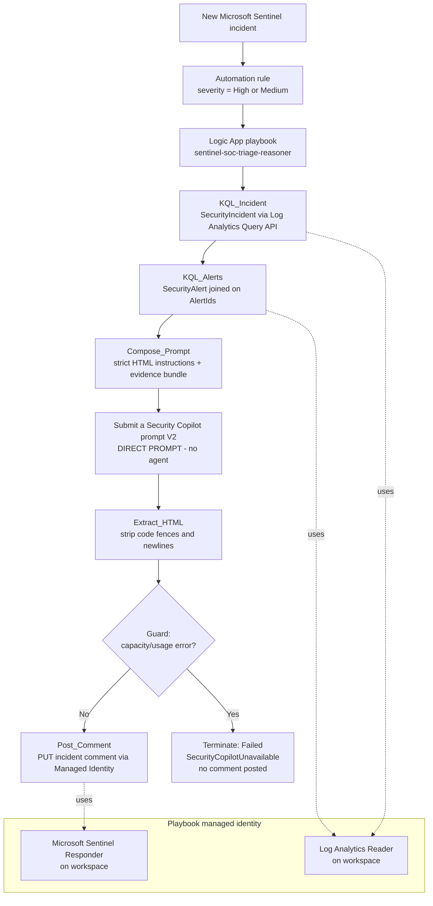

# Sentinel SOC Triage Reasoner (No-Agent)

A portable, repeatable Azure-native pipeline that automatically triages a Microsoft Sentinel incident and writes an HTML triage report back to the incident as a comment — **without using a Security Copilot agent**.

> **Design statement — no agents are used.**
> This asset deliberately does **not** invoke a Security Copilot custom/builder agent at runtime. All data retrieval runs as deterministic KQL inside the Logic App, and Security Copilot is used only as a **direct prompt** (the `ProcessPrompt` / *Submit a Security Copilot prompt (V2)* connector action) to reason over the collected evidence. See [Why no agent](#why-no-agent-design-rationale) for the platform limitations that led to this design.

This is the no-agent counterpart to the [`Sentinel SOC Triage Autopilot`](../Sentinel%20SOC%20Triage%20Autopilot) asset (which uses Sentinel MCP inside a Copilot agent). Use this one when you need an agent-free, connector-triggerable, fully automated playbook.

---

## Contents

| File | Purpose |
| --- | --- |
| `read.md` | This deployment and execution guide. |
| `logic-app/infra/main.bicep` | Bicep template: Logic App playbook, system-assigned managed identity, RBAC, and the two managed API connections. |
| `logic-app/infra/workflow-definition.json` | Parameterized Logic App workflow (Sentinel incident trigger → KQL → prompt → guarded HTML writeback). No hardcoded tenant/subscription/workspace IDs. |
| `logic-app/infra/main.parameters.sample.json` | Sample deployment parameters. Copy to `main.parameters.json` before deploying. |
| `logic-app/infra/automation-rule.sample.json` | Sample Sentinel automation rule that runs the playbook on incident creation. |

---

## Architecture



**Key point:** the box labelled *Submit a Security Copilot prompt V2* is a **direct, synchronous prompt** to Security Copilot. There is no agent, no plugin, and no MCP skillset in the runtime path.

---

## Why no agent (design rationale)

The original design used a native Security Copilot builder agent with the Sentinel data-lake MCP tools (`query_lake`, etc.). That approach was abandoned because of the following platform limitations (as of this writing):

1. **MCP builder agents cannot be shared workspace-wide.** Publishing an agent whose required skillset is the native `MCP.Sentinel` data-lake collection silently reverts to "Myself only." There is no consent surface to set `consentedToRequiredSkillsets = true` for other users — and it is not fixable by a Global Administrator.
2. **Such agents never appear in the Logic Apps connector.** The connector only lists agents with `consentedToRequiredSkillsets = true` and a Default trigger. MCP agents meet neither, so they cannot be triggered by a playbook.
3. **Manifest agents can be shared but cannot reference `query_lake`.** Referencing MCP tools from a manifest agent fails at publish/runtime ("Unable to find skill 'query_lake'").
4. **`ExecuteAgent` is fire-and-forget.** Even a shareable agent returns `Status: Pending` with no result-retrieval operation, so a Logic App cannot get the agent's report inline.

**Resolution:** move data collection into the Logic App (deterministic KQL) and use Security Copilot purely as a reasoning brain via the synchronous `ProcessPrompt` action. This keeps the reasoning quality of the LLM while producing a connector-triggerable, fully automated pipeline. The only capability lost is adaptive, agent-driven query planning against the data lake.

---

## Prerequisites

- An existing Microsoft Sentinel workspace (Log Analytics workspace with SecurityInsights enabled) in the target resource group.
- A **Security Copilot capacity (SCU)** provisioned and associated with the Security Copilot workspace that backs the Security Copilot connection. See [Capacity and cost](#capacity-and-cost) — this is the single most common cause of runtime failures.
- Azure CLI with the `az` command and permission to deploy to the resource group (Owner or Contributor + User Access Administrator, because the template creates role assignments).
- Rights to authorize managed API connections (Security Copilot and Microsoft Sentinel).

---

## Deployment

### 1. Deploy the Logic App, identity, RBAC, and connections

```bash
cd "logic-app/infra"
cp main.parameters.sample.json main.parameters.json
# Edit main.parameters.json: set location and workspaceName.

az deployment group create \
  --resource-group <RG> \
  --template-file main.bicep \
  --parameters @main.parameters.json
```

The `logAnalyticsWorkspaceCustomerId` used by the KQL actions is resolved automatically from the workspace — you do not pass it manually.

### 2. Authorize the two managed API connections (one-time)

Managed connectors require an interactive consent that Bicep cannot perform. In the Azure portal, open each connection and authorize it:

- **`securitycopilot-triage-reasoner`** — sign in as an identity that has access to the Security Copilot workspace.
- **`azuresentinel-triage-reasoner`** — sign in as an identity with access to the Sentinel workspace.

Until both connections show **Connected**, the trigger and the prompt action will not run.

### 3. Grant Sentinel permission to run the playbook

The Azure Security Insights service principal (app ID `98785600-1bb7-4fb9-b9fa-19afe2c8a360`) must hold **Microsoft Sentinel Automation Contributor** on the resource group that contains the playbook:

```bash
SP_OBJECT_ID=$(az ad sp show --id 98785600-1bb7-4fb9-b9fa-19afe2c8a360 --query id -o tsv)
az role assignment create \
  --assignee-object-id "$SP_OBJECT_ID" \
  --assignee-principal-type ServicePrincipal \
  --role "Microsoft Sentinel Automation Contributor" \
  --scope "/subscriptions/<SUB_ID>/resourceGroups/<RG>"
```

### 4. Create the automation rule

Edit `automation-rule.sample.json` (set `<SUB_ID>`, `<RG>`, `<TENANT_ID>`, and the playbook name if changed), then:

```bash
az rest --method put \
  --url "https://management.azure.com/subscriptions/<SUB_ID>/resourceGroups/<RG>/providers/Microsoft.OperationalInsights/workspaces/<WORKSPACE_NAME>/providers/Microsoft.SecurityInsights/automationRules/$(python -c 'import uuid;print(uuid.uuid4())')?api-version=2023-11-01" \
  --body @automation-rule.sample.json
```

The sample rule scopes to **High/Medium** severity on incident creation. Broaden or narrow the `IncidentSeverity` condition as needed.

---

## How it works

1. A new Sentinel incident fires the **automation rule**, which runs the playbook and passes the incident object (including `incidentNumber` and the incident ARM `id`) to the **Microsoft Sentinel incident trigger**.
2. **KQL_Incident** queries `SecurityIncident` for the incident metadata via the Log Analytics Query API, authenticated with the playbook's managed identity (Log Analytics Reader).
3. **KQL_Alerts** joins `SecurityAlert` on the incident's `AlertIds` to pull alert and entity evidence.
4. **Compose_Prompt** assembles a strict-HTML instruction block plus the evidence bundle.
5. **Submit a Security Copilot prompt (V2)** sends the prompt to Security Copilot as a direct, synchronous evaluation and returns `EvaluationResultContent`. **No agent is invoked.**
6. **Extract_HTML** strips any code fences/newlines from the response.
7. **Guard** checks the response for known capacity/usage error strings. If clean, **Post_Comment** writes the HTML report to the incident via an ARM comment `PUT` using the managed identity (Sentinel Responder). If the response is a capacity error, the run **terminates as Failed** with `SecurityCopilotUnavailable` and **no comment is posted** (so incidents never receive an error message as a "report").

### Report structure

The generated HTML report contains these sections in order: Report Metadata; Assumptions Made; 1) Executive Summary; 1a) Top Priority Findings; 2) Incident Overview; 2a) Alert Summary; 3) Entity and Scope Analysis; 4) Evidence and Correlation; 5) Threat Intelligence and IOC Findings; 5a) Graph and Blast Radius Findings; 6) Classification and Determination; 7) Recommended Actions; 8) Evidence Gaps.

---

## Capacity and cost

Security Copilot reasoning consumes **Security Compute Units (SCU)**. In testing, a single triage evaluation cost **~4 SCU**. If the provisioned capacity is lower than the per-triage cost (e.g. 3 SCU/hour), a run may only partially succeed before the workspace is throttled.

When the capacity is exhausted, the connector returns an HTTP 200 whose content is a **generic error** — *"Try rewording your prompt and submit it again…"* — which actually means *"Copilot can't respond right now due to high usage."* The **Guard** step in this workflow detects that string and fails the run cleanly instead of posting the error onto the incident.

To make throughput sustainable:

- **Enable/raise overage units** on the capacity (pay-per-use bursts beyond the provisioned SCUs), and/or
- **Increase provisioned SCUs** (Security Copilot → *Usage monitoring* → *Change units*) so a single triage (~4 SCU) fits with headroom.

---

## Troubleshooting

| Symptom | Cause | Fix |
| --- | --- | --- |
| Run `Failed` with `SecurityCopilotUnavailable`; no comment posted | Security Copilot capacity/usage throttling | Enable overage or raise provisioned SCUs; re-run. |
| `Submit a Security Copilot prompt (V2)` returns "Try rewording your prompt…" | Same capacity throttling (connector masks the real cause) | Same as above. |
| Trigger never fires | `azuresentinel` connection not authorized, or automation rule missing/disabled, or Sentinel SP lacks Automation Contributor | Authorize the connection; verify the rule; grant the role. |
| KQL actions return empty rows | Incident/alert not yet ingested, or MI lacks Log Analytics Reader | Confirm ingestion; verify the workspace role assignment. |
| `Post_Comment` returns 403 | MI lacks Microsoft Sentinel Responder on the workspace | Confirm the role assignment created by the template. |

---

## This asset vs. the MCP-agent asset

| | **Sentinel SOC Triage Reasoner (No-Agent)** — this asset | **Sentinel SOC Triage Autopilot** — sibling asset |
| --- | --- | --- |
| Reasoning | Direct Security Copilot prompt (`ProcessPrompt`) | Security Copilot custom agent |
| Data retrieval | Deterministic KQL in the Logic App | Sentinel MCP (`query_lake`, triage/data-exploration tools) |
| Adaptive query planning | No (fixed KQL) | Yes (agent-driven) |
| Connector-triggerable | Yes | Requires MCP agent sharing (currently blocked) |
| Runtime dependency on MCP | None | Sentinel MCP servers |
| Best for | Agent-free, fully automated production triage today | Interactive/agentic triage in a Copilot + MCP environment |

---

## Security notes

- The playbook uses a **system-assigned managed identity** with least privilege: **Log Analytics Reader** (read evidence) and **Microsoft Sentinel Responder** (write comments) on the workspace only.
- No secrets are stored in the workflow; all Azure calls use the managed identity.
- Redact your tenant, subscription, workspace, and connection identifiers before sharing any deployed copy — the templates in this folder are already parameterized and contain no environment-specific IDs.

---

## ⚠️ Disclaimer

This project is provided for educational and demonstration purposes only.

The software, agents, workflows, prompts, and examples included in this repository are provided **"as is"**, without warranties or guarantees of any kind, express or implied. The authors and contributors make no representations regarding reliability, safety, suitability, security, legality, or fitness for any particular purpose.

By using this project, you acknowledge and agree that:

- 🧑‍💻 You are solely responsible for how you use, modify, deploy, or distribute the software.
- 🧪 You must thoroughly test the project in a controlled and secure environment before using it in production or with sensitive systems/data.
- 🤖 AI agents and automated systems may produce unexpected, inaccurate, incomplete, or harmful outputs and actions.
- ⚠️ This project may contain experimental features, unsafe behaviors, or incomplete safeguards.
- 🚫 The authors are not responsible for any damage, losses, security incidents, operational failures, legal issues, compliance violations, data loss, financial losses, or other consequences resulting from the use of this project.
- 📜 Users are responsible for ensuring compliance with all applicable laws, regulations, platform policies, licensing requirements, and organizational security practices.

This repository is not intended for use in safety-critical, regulated, or production environments without independent review, validation, monitoring, and appropriate safeguards.

### 🚨 Use at your own risk.
